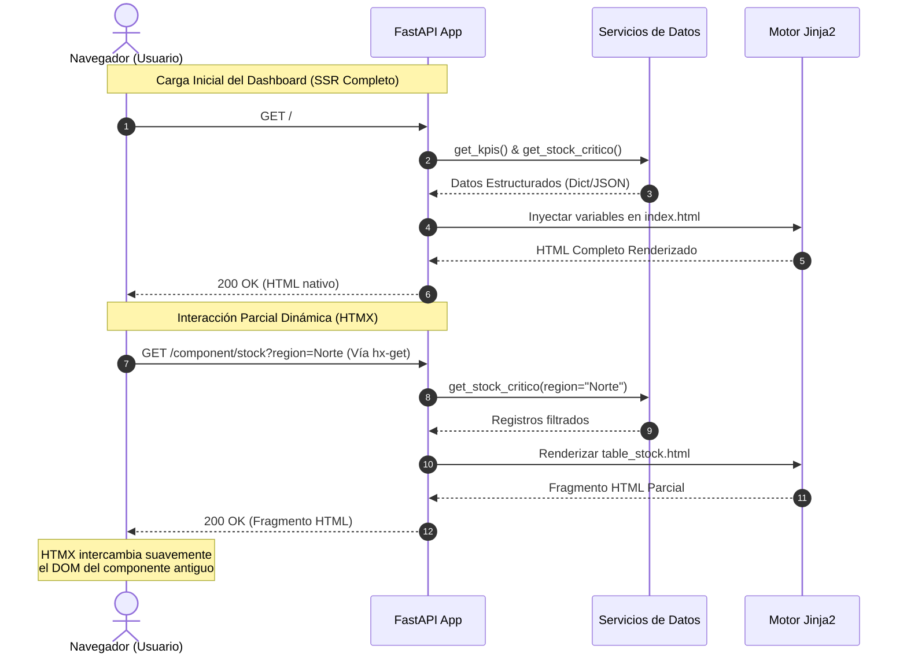

# Dashboard de Inteligencia Operativa - Nexus Logistic

Este proyecto es una solución web full-stack de alto rendimiento diseñada bajo el paradigma de **Renderizado del Lado del Servidor (SSR)** para la gestión y monitoreo en tiempo real de un centro de distribución logística de e-commerce.

La aplicación permite supervisar indicadores clave (KPIs), analizar volúmenes de carga y filtrar alertas de inventario crítico de manera reactiva, eliminando la sobrecarga en el navegador de los frameworks Single Page Application (SPA) tradicionales.

---

## Stack Tecnológico y Justificación

- **FastAPI (Python):** Seleccionado como motor del backend debido a su soporte nativo asíncrono (`async/await`), velocidad de ejecución comparable a Node.js o Go, y su perfecta compatibilidad con arquitecturas orientadas a servicios.
- **Jinja2:** Utilizado para la inyección dinámica de datos estructurados en las plantillas HTML desde el servidor. Garantiza un excelente tiempo de respuesta inicial (*First Contentful Paint*).
- **HTMX:** Framework ligero que permite realizar peticiones AJAX directamente mediante atributos HTML personalizados. Posibilita la actualización de widgets e intercambio de fragmentos del DOM de forma dinámica sin recargar la página completa.
- **Tailwind CSS + Custom CSS:** Framework de diseño utilitario complementado con estilos dedicados de animación para construir una interfaz moderna, limpia, responsiva y fluida.

---

## Diagrama de Arquitectura y Flujo de Datos

